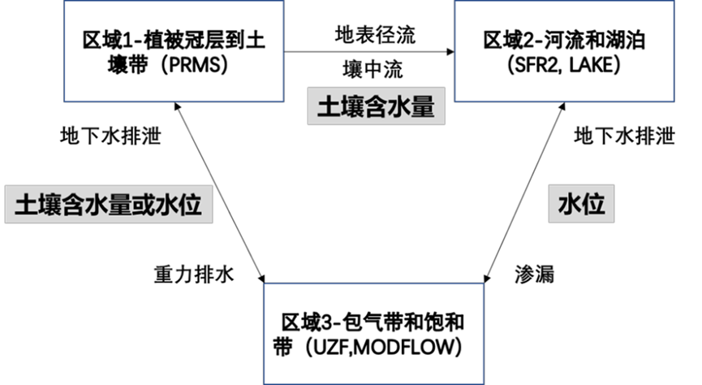
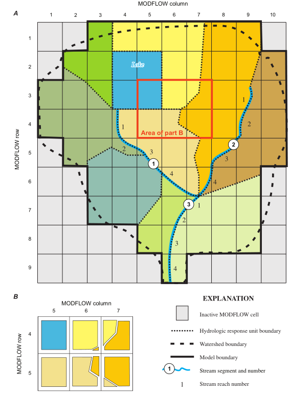
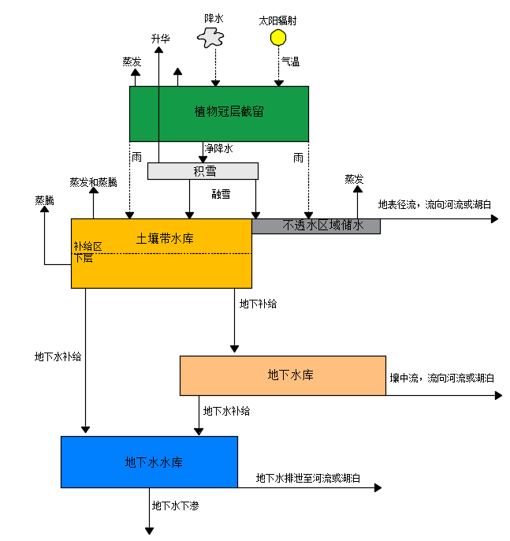
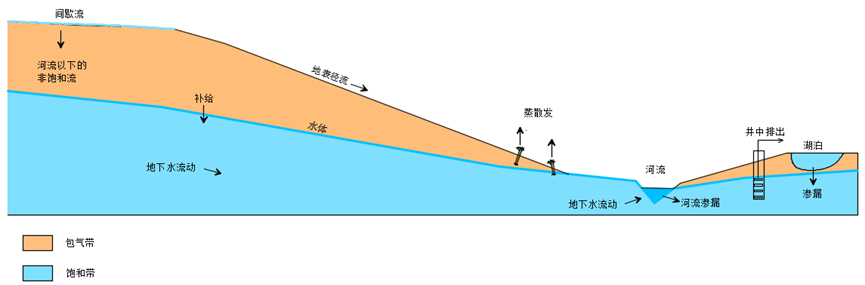
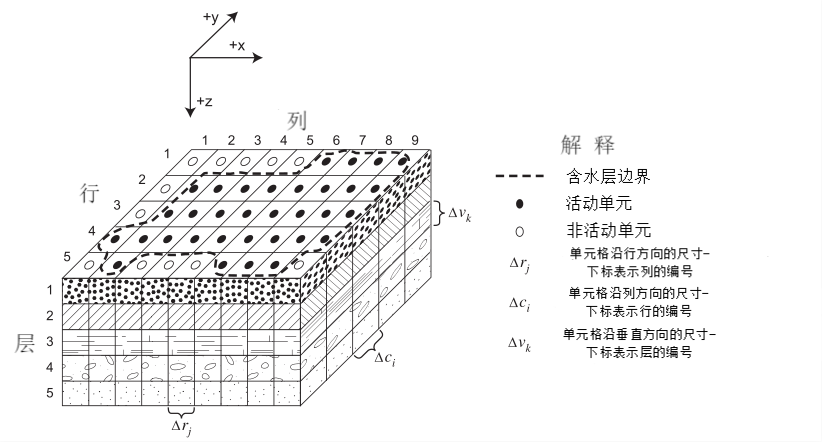
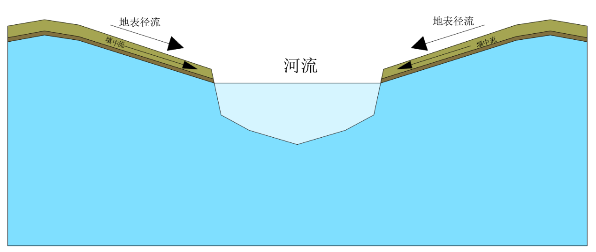
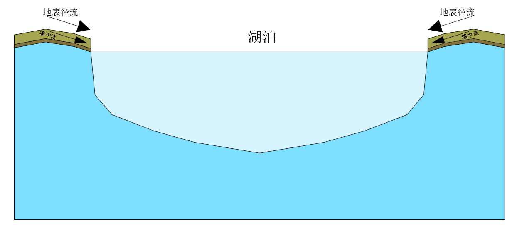
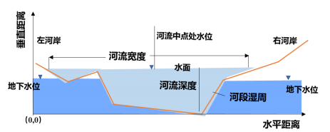
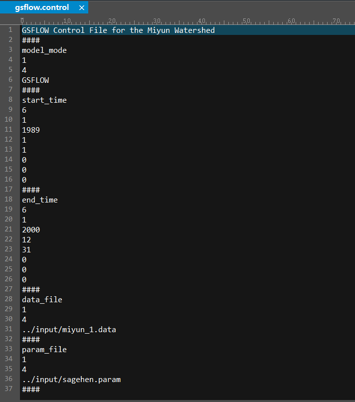

# GSFLOW 使用手册分析

> 本文档基于《GSFLOW用户使用手册（中文版）》（lyp课题组）整理，面向零基础读者。
> 目标：看懂 GSFLOW 是什么、整体框架长什么样、一次完整模拟怎么跑下来。
> 手册中提取的关键图片已放在 `images/` 文件夹中，正文中直接引用。

---

## 一、GSFLOW 是什么？（一分钟版）

**一句话**：GSFLOW 是一个把"地表水模型"和"地下水模型"拼接在一起的联合模拟系统，用来同时模拟降雨→河流→土壤→地下水这一整条水的旅程。

- 全称：**G**round-water/**S**urface-water **FLOW**（地下水和地表水流模型）
- 开发方：美国地质调查局（USGS）
- 组成（本手册对应版本 GSFLOW 2.2.0）：
  - **PRMS 5.2.0** —— 降雨径流模拟系统，管"地上"：植物冠层、积雪、土壤、地表径流
  - **MODFLOW-2005 1.12.0** —— 模块化地下水流动模型，管"地下"：非饱和带、含水层、河流湖泊与地下水的交换

**为什么要耦合？** 传统模型只看地表或只看地下，考虑因素单一。比如评估抽水影响的模型往往不考虑土壤层水流；评估气候变化对地表水影响的模型不考虑地质和地表水相互作用。气候变化和人类活动加剧后，地表水和地下水交互越来越频繁，需要一个"全包"的模型。

**耦合方式**：手册指出综合水文模型有三种构建思路——①集成型（一个系统内同时求解，难）、②**联合型（GSFLOW 采用，把两个成熟模型连接起来，应用最广）**、③独立型（在地下水模型上扩展地表模块）。

---

## 二、整体框架（先看这张地图）

### 2.1 手册的整体结构（共八章）

| 章节 | 内容 | 对小白的用途 |
|------|------|-------------|
| 前言 + 第一章 模型介绍 | 背景、历史、原理（PRMS、MODFLOW 及其耦合） | **必读**，建立概念 |
| 第二章 模型模块 | 25 个 PRMS 模块 + 16 个 MODFLOW 包 + GSFLOW 集成模块 | 当"字典"查，用到再翻 |
| 第三章 模型构建 | ArcGIS 数据准备 → PRMS 构建 → MODFLOW 构建 → 运行 | **核心操作手册** |
| 第四章 模型输入和输出 | 5 类输入文件、各类输出文件的格式说明 | 配置文件时查阅 |
| 第五章 模型率定 | 调参、Nash 效率系数、敏感性分析 | 出结果后必看 |
| 第六~八章 实例 1/2/3 | 密云水库、山东聊城、永定河三个完整案例 | 照着练手的范本 |

### 2.2 模型的三层架构（最核心的一张图）

GSFLOW 把流域分成**三个区域**，两个模型各管一块，中间不停交换水量：



| 区域 | 范围 | 由谁模拟 | 通俗理解 |
|------|------|---------|---------|
| **区域一** | 植物冠层 → 积雪 → 不透水面 → 土壤层 | **PRMS** | "地面以上和土壤里"：下雨后水被树冠拦截、积雪存水、下渗进土里 |
| **区域二** | 河流 + 湖泊 | **MODFLOW**（SFR 河流包 / LAK 湖泊包） | "地表水面"：河和湖是地上地下水的交换通道 |
| **区域三** | 非饱和带 + 饱和带（含水层） | **MODFLOW**（UZF 非饱和带包 + 地下水核心） | "地下"：土壤以下的包气带和真正的地下水 |

水在三个区域间不停流动：降雨进入区域一 → 一部分下渗成为"重力排水"进入区域三 → 地下水又可能排泄进河流湖泊（区域二）→ 河流湖泊与地下水互补给。

### 2.3 两个模型怎么"对话"（耦合机制）

这是理解 GSFLOW 的关键，也是和单跑 PRMS / MODFLOW 最大的区别：

**1）空间上的桥梁——重力水库（GVR）**

PRMS 把流域切成许多**水文响应单元（HRU）**——每个 HRU 内部水文性质视为均匀；MODFLOW 把地下切成**有限差分单元**（行 i、列 j、层 k 的矩形网格）。两套网格形状对不上，怎么办？

答案是：取两者的**交集**，每个交集叫一个**重力水库（GVR，Gravity Reservoir）**。土壤层的水通过 GVR"漏"到下面的 MODFLOW 单元里；地下水也能通过 GVR"顶"回土壤层。



四个关键拓扑参数（记住这四个名字就行）：

| 参数 | 含义 |
|------|------|
| `gvr_hru_id` / `gvr_cell_id` | 每个 GVR 对应哪个 HRU、哪个 MODFLOW 单元 |
| `gvr_hru_pct` / `gvr_cell_pct` | GVR 占该 HRU / 该单元的面积比例（各自加总必须 = 1，保证水量守恒） |

**2）流量上的桥梁——两个转换模块**

- `gsflow_prms2mf`：把 PRMS 算出的重力排水**加到** MODFLOW 单元上
- `gsflow_mf2prms`：把 MODFLOW 算出的地下水排泄**送回** PRMS
- `gsflow_setconv`：处理两边的单位换算（PRMS 用英亩-英寸，MODFLOW 用立方米等）

**3）时间上的统一——日时间步长**

GSFLOW 固定按**天**计算。每个日时间步长内，PRMS 和 MODFLOW 交替计算、交换水量，迭代直到收敛。MODFLOW 的"应力周期"长度也必须是天的整数倍。

### 2.4 水都走哪些路？（概念图速览）

**PRMS 视角（地上）**——用一串"水库"模拟水的暂存与流动：



- 输入：降水、最高/最低气温、太阳辐射（驱动一切）
- 水的路径：降水 → 冠层拦截（蒸发回去）→ 积雪（攒着慢慢化）→ 地表（形成地表径流 or 下渗）→ 土壤带水库（毛细水，供蒸发蒸腾）→ 多余的水下渗 → 壤中流 / 地下水
- HRU 内部有多个独立水库：冠层水库、积雪水库、土壤水库等

**MODFLOW 视角（地下）**——三维网格 + 河流湖泊边界：




- 含水层切成行×列×层的三维网格，每个单元中心算一个地下水位（水头）
- 常用包：LPF（含水层性质）、SFR（河流）、LAK（湖泊）、UZF（非饱和带一维流动）、WEL（井）、PCG（求解器）等

**地表水 ↔ 河流湖泊的连接**：





- HRU 的地表径流和壤中流沿"级联路径"从高处 HRU 流向低处，最终汇入河段或湖泊
- 地下水位高于河水位 → 地下水补给河流；反之 → 河流渗漏补给地下水（湖泊同理）

---

## 三、运行流程（从零跑通一次模拟）

整体分**四大步**：数据准备（ArcGIS）→ 模型构建（PRMS + MODFLOW）→ 预热与正式运行（Spin-up + Restart）→ 率定验证。流程总览：

```
┌─────────────────────────────────────────────────────────┐
│ 第 1 步：ArcGIS 数据准备                                  │
│   DEM → 流域 → 河网 → MODFLOW网格 → HRU → GVR            │
├─────────────────────────────────────────────────────────┤
│ 第 2 步：PRMS 构建（paramtool）                           │
│   维度大小 → 空间参数导入 → 导出 param 文件               │
├─────────────────────────────────────────────────────────┤
│ 第 3 步：MODFLOW 构建（ModelMuse）                        │
│   选包 → 设时间 → 导入 shp → 设参数边界 → 导出文件        │
├─────────────────────────────────────────────────────────┤
│ 第 4 步：运行                                             │
│   Spin-up 预热（PRMS_only → MODFLOW_only → GSFLOW）      │
│   → Restart 正式模拟（读取预热结果作为初始条件）           │
├─────────────────────────────────────────────────────────┤
│ 第 5 步：率定与验证                                       │
│   PRMS 率定 → MODFLOW 率定 → GSFLOW 联合率定 → 敏感性分析 │
└─────────────────────────────────────────────────────────┘
```

### 第 1 步：ArcGIS 数据准备（手册 3.1 节）

目标：把一张 DEM（数字高程图）加工成模型需要的空间文件。主链条如下（箭头后为手册中的输出文件名）：

1. **下载 DEM**（地理空间云），建数据库，加载合并（Mosaic to new raster）→ `img`，并把坐标系改为投影坐标系（如 WGS 1984 UTM）
2. **填洼**（Fill）→ `fil`：消除 DEM 里的假洼地
3. **水流方向**（Flow Direction）→ `fdr`
4. **汇流累积量**（Flow Accumulation）→ `fac`
5. **定义流域出口**（新建点要素）→ 捕捉倾泻点（Snap Pour Point）→ `streamgage`
6. **提取流域**（Watershed）→ `natbnd` → 转矢量边界（Raster to Polygon）→ `natbndf`
7. **提取河流** → 清除流域外河流 → 河流链接 → 生成河段（Stream to Feature）→ `strseg`
8. **生成 MODFLOW 网格**（Create Fishnet + Feature to Polygon）→ `mfcells`，并给属性表加 ROW、COL、CELL_ID、CELL_AREA 字段；筛选出活动单元格 → `activeCells`，融合成模型域 → `modelDomain`
9. **生成 HRU**（需 ArcHydro 工具：Catchment Grid Delineation → Expand → Raster to Polygon → Clip）→ `hrus`，属性表加 HRU_ID、HRU_AREA、X、Y
10. **生成 GVR**（Union：hrus × activeCells）→ `gvrs`
11. **给 HRU 导入 PRMS 参数**：植被类型 cov_type、冬/夏植被覆盖密度、土壤最大含水量 soil_moist_max、海拔、坡度、坡向等 18 个参数
12. **制作 GVR 地图**：添加 gvr_hru_id、gvr_cell_id、gvr_cell_pct、gvr_hru_pct 四个属性（就是框架部分说的那四个拓扑参数）

> 小白提示：这一步全是 GIS 操作，手册里每一步都配了截图和工具路径，照着点即可。最容易出错的是坐标系（必须统一投影坐标系）和 HRU 编号重复（需用 Editor 合并保证唯一）。

### 第 2 步：PRMS 构建（手册 3.2 节）

工具：**paramtool**（GSFLOW 文件夹里，需先装 Java，双击 paramtool.bat）

1. 设置**维度大小**（数组尺寸），四个核心维度：

| 维度 | 含义 | 填什么 |
|------|------|--------|
| `nhru` | HRU 数量 | 你的 HRU 个数 |
| `ngw` | PRMS 地下水库数量（仅 PRMS 独立模拟用） | = HRU 数量 |
| `ngwcell` | MODFLOW 有限差分单元数 | 鱼网网格数量 |
| `nhrucell` | HRU 与单元的唯一交集数 | = GVR 数量 |

2. 导入**空间参数**（从 ArcGIS 来的 HRU/GVR 参数；级联参数可先简化设置）
3. **导出 param 文件**到 Input 文件夹

### 第 3 步：MODFLOW 构建（手册 3.2 节后半）

先在 ArcGIS 中给 `mfcells.shp` 补 4 个属性：ALT（单元格高程，Zonal Statistics 统计）、ACTIVE（1=活动 / 0=无效）、PRECIP（降水，用经验公式由高程算）、IRUNBND（单元主要归属的 HRU 编号）。

然后在 **ModelMuse** 软件中：

1. 按 mfcells 的行列数、XY 坐标创建网格
2. **选包**：LPF（层属性流）+ UZF（非饱和流）+ SFR（河流路由，勾选 Unsaturated Flow）+ PCG（求解器，MXITER=400、HCLOSE=0.005 等）
3. **设时间**：应力周期数和起止时间（如 13 个周期覆盖 360 天），ITMUNI=days；LENUNI=meters；勾选 Wetting Active
4. **导入 mfcells.shp**（ALT/PRECIP/ACTIVE/IRUNBND 四个值）和 **strseg.shp**（河段）
5. 设置河段参数（河床渗透系数 0.1、河床厚度 1、河宽 3、上下游非饱和参数 THTS1=0.3 等），给最后一段设 Gage 出口
6. 导入**井**（抽水速率/回灌率）
7. 设置**含水层渗透系数**（分区设 Kx/Ky/Kz，如全区 0.06、河岸冲积层 0.25）、Model_Top=ALT、含水层底=ALT-60、初始水头=ALT 等
8. 设置**流量边界**和**通用水头边界**，链接河流（Model → Link Streams）
9. **导出 MODFLOW 文件**

### 第 4 步：运行（手册 3.3 节）——Spin-up + Restart 两段式

为什么要分两段？模型启动时各水库都是空的，直接跑正式模拟前期结果不可信。所以要先用一段时间"**预热（Spin-up）**"让水量平衡稳定下来，再从预热结束的状态接着跑正式模拟（**Restart**）。

**Spin-up 预热**（依次跑三种模式，一般各跑 1~2 个月即可）：

1. **PRMS_only**：control 文件设 start_time / end_time；`save_vars_to_file = 1` 并设 `var_save_file`（初始条件保存路径）；导入降雨、最高/最低气温数据 → 运行 PRMS
2. **MODFLOW_only**：同样设时间，Name 文件里指定 IWRT（保存初始条件）；**注意修改 SFR 参数使所有河段上游海拔高于下游**（否则报错）→ 运行 MODFLOW
3. **GSFLOW**：设时间，`save_vars_to_file = 1` 设 var_save_file（**路径不能与 PRMS 的相同**）→ 运行 GSFLOW

**Restart 正式模拟**：

- **start_time 必须设为 Spin-up 的 end_time 的后一天**（连续衔接）
- `init_vars_from_file = 1`，`var_init_file` 指向预热保存的初始条件；MODFLOW 侧在 Name 文件指定 IRED（读取路径）并改 IWRT（新的保存路径）
- 运行 GSFLOW → 得到正式模拟结果

> 小白提示：手册给了防混淆技巧——PRMS 的初始条件路径名统一用奇数编号，GSFLOW 的用偶数编号。

运行命令行示例：`gsflow.exe sagehen.control`（不指定文件名时自动找当前目录的 `gsflow.control`）。

### 第 5 步：率定与验证（手册第五章）

率定 = 反复调参数、跑模型、对比实测值，直到拟合达标。采用**逐步程序**：

1. **PRMS 率定**（model_mode 设为 PRMS 单独跑）：数据分三期——初始化期、校准期、验证期（如 Sagehen 案例用 1980–1981 初始化、1981–1988 校准、1988–1995 验证）。先调影响平均流量的参数（降水递减因子 snow_adj/rain_adj、蒸散发参数），再调影响径流过程的参数。拟合优度用 **Nash-Sutcliffe 效率系数**：1.0 = 完美，0 = 可信但误差大，负值 = 模型不可信
2. **MODFLOW 率定**（model_mode 设为 MODFLOW 单独跑）：试错法调**渗透系数 K** 和**给水度 Sy**，让稳态径流和井水位逼近实测值
3. **GSFLOW 联合率定**：把前两步的参数带进来，重点微调影响 PRMS↔MODFLOW 之间流量的参数；地表水部分靠 PRMS 参数、地下水部分靠 K 和 Sy
4. **敏感性分析**：K 和 Sy 通常是不确定性的主要来源

---

## 四、输入与输出文件速查（手册第四章）

### 输入文件（5 类）

| 文件 | 作用 | 关键点 |
|------|------|--------|
| **GSFLOW Control 文件** | 总开关：运行模式（`model_mode` = GSFLOW/PRMS/MODFLOW）、起止时间、输入输出文件名、初始条件参数 | 每个参数由 `####` 分隔符 + 名称 + 值个数 + 类型 + 值组成 |
| **PRMS Data 文件** | 气象驱动数据时间序列：降水、最高/最低气温（必需）、太阳辐射等 | 必须逐日一条，相邻时间差正好 24 小时 |
| **PRMS Parameter 文件** | 大部分模型参数 + 维度定义 | 三段式：标题、维度（Dimensions）、参数（Parameters） |
| **MODFLOW Name 文件** | MODFLOW 各包输入输出文件的清单 | 每行：文件类型 + 单元号 + 文件名；必须含 BAS 和 DIS 两个文件 |
| **MODFLOW 包输入文件** | 各包（LPF/SFR/UZF/PCG 等）的具体数据 | 见手册第二章各包说明 |

control 文件长这样（节选）：



### 输出文件（3 组）

| 文件 | 内容 | 用途 |
|------|------|------|
| **GSFLOW 水平衡文件** | 分区域（地表/土壤/非饱和/饱和）的进出流量和储量变化汇总表 | 检查水量守恒 |
| **GSFLOW CSV 文件** | 每个时间步长的模拟结果（冠层截留量、土壤水、蒸散发流量等变量） | 导入 Excel 做图分析 |
| **GSFLOW 日志文件**（gsflow.log） | 全部运行信息、警告错误、迭代统计 | **出错必查这里** |
| PRMS 输出 | 水平衡、统计变量、动画文件 | 地表过程分析 |
| MODFLOW 输出 | List 文件（水头、预算）、DATA 文件 | 地下过程分析 |

---

## 五、三个实战案例（手册第六~八章）

| 案例 | 研究区 | 研究主题 | 特色 |
|------|--------|---------|------|
| 实例 1（第六章） | 密云水库流域 | 地表水与地下水转化关系模拟 | 完整走一遍构建→率定→结果分析（入库径流、地下水位、地表地下水转化时空规律） |
| 实例 2（第七章） | 山东聊城（典型地下水超采区） | 超采区地表地下水转化 + 情景预测 | 亮点是**情景模拟**：单独/组合考虑地下水开采、南水北调、雨洪资源利用对地下水位的影响 |
| 实例 3（第八章） | 永定河流域 | 地下水埋深数值模拟 | 河道**补水情景**评价、地下水位空间分布、地表地下水转化 |

小白建议：第一遍通读时可以直接跳到第六章，把它当作"带讲解的完整例题"对照前五章的流程看。

---

## 六、新手常见坑（从手册中提炼）

1. **坐标系不统一**：ArcGIS 部分必须转成投影坐标系（如 WGS 1984 UTM），否则面积、长度计算全错
2. **HRU 编号重复**：生成 hrus 后要检查 GRIDCODE 是否有重复，有则用 Editor 合并
3. **河段上下游高程**：跑 MODFLOW 前确保所有河段上游海拔 > 下游海拔，否则运行报错
4. **初始条件路径混淆**：PRMS 和 GSFLOW 的 var_save_file / var_init_file 路径不能相同（手册建议奇偶数命名区分）
5. **Restart 起始时间**：必须紧跟 Spin-up 结束日的**后一天**，否则数据断档
6. **时间步长**：GSFLOW 只支持日步长，PRMS 数据文件必须逐日连续，MODFLOW 应力周期长度必须是天的整数倍
7. **水量守恒检查**：`gvr_hru_pct`（每个 HRU）和 `gvr_cell_pct`（每个单元）各自加总必须等于 1
8. **收敛失败**：迭代不收敛时优先查日志文件 gsflow.log，通常是求解器参数（PCG 的 HCLOSE/RCLOSE）或数据问题

---

## 七、关键术语小词典

| 术语 | 全称 | 一句话解释 |
|------|------|-----------|
| HRU | Hydrologic Response Unit | 水文响应单元：地表被切成的"性质均匀"小块 |
| GVR | Gravity Reservoir | 重力水库：HRU 与 MODFLOW 单元的交集，是地上地下对话的桥梁 |
| DEM | Digital Elevation Model | 数字高程模型：描述地形起伏的栅格图 |
| 应力周期 | Stress Period | MODFLOW 的时间段概念，边界条件在一个周期内不变 |
| SFR / LAK | Streamflow-Routing / Lake | MODFLOW 的河流包 / 湖泊包 |
| UZF | Unsaturated-Zone Flow | MODFLOW 的非饱和带（包气带）流动包 |
| LPF / PCG | Layer-Property Flow / Preconditioned Conjugate Gradient | 含水层性质包 / 求解器包 |
| Spin-up | — | 预热运行：让模型"热身"达到稳定初始状态 |
| Nash 效率系数 | Nash-Sutcliffe Efficiency | 模拟值与实测值拟合好坏的指标，越接近 1 越好 |
| ModelMuse | — | USGS 出的 MODFLOW 前处理软件（图形界面建模） |
| paramtool | — | PRMS 参数文件的可视化编辑工具（需 Java） |

---

## 附：本文档引用的图片清单

| 图片 | 手册原图号 | 内容 |
|------|-----------|------|
| fig1-1_水在地表和地下的分布流动与相互作用.png | 图 1.1 | 综合水文模型考虑的反馈过程 |
| fig1-2_PRMS模拟的流域示意图及气候输入.png | 图 1.2 | PRMS 概念模型 |
| fig1-3_MODFLOW模拟的含水层系统中水的流动.png | 图 1.3 | MODFLOW 模拟的地下水过程 |
| fig1-4_离散化的含水层系统.png | 图 1.4 | 三维有限差分网格 |
| fig1-5_GSFLOW三个区域之间水流交换示意图.png | 图 1.5 | **GSFLOW 核心框架图** |
| fig1-6_重力水库连接HRU与有限差分单元.png | 图 1.6 | GVR 耦合机制 |
| fig1-7 / fig1-8 | 图 1.7 / 1.8 | 地表径流壤中流与河流/湖泊的交互 |
| fig1-9_假设流域的陆地和湖泊HRU划定.png | 图 1.9 | HRU 划分示例 |
| fig1-10 / fig1-11 | 图 1.10 / 1.11 | 有限差分单元 / 地下水与河流交互 |
| fig3-3_ArcGIS填洼后的DEM示例.png | 图 3.3 | ArcGIS 数据处理示例 |
| fig3-98~104 | 图 3.98~3.104 | Spin-up / Restart 运行配置截图 |
| fig4-1_GSFLOW的control文件示例.png | 图 4.1 | control 文件格式 |

*文档整理日期：2026-09-16；来源：《GSFLOW用户使用手册（中文版）》（lyp课题组，共 8 章 + 前言 + 参考文献，内嵌 355 张图片）*
